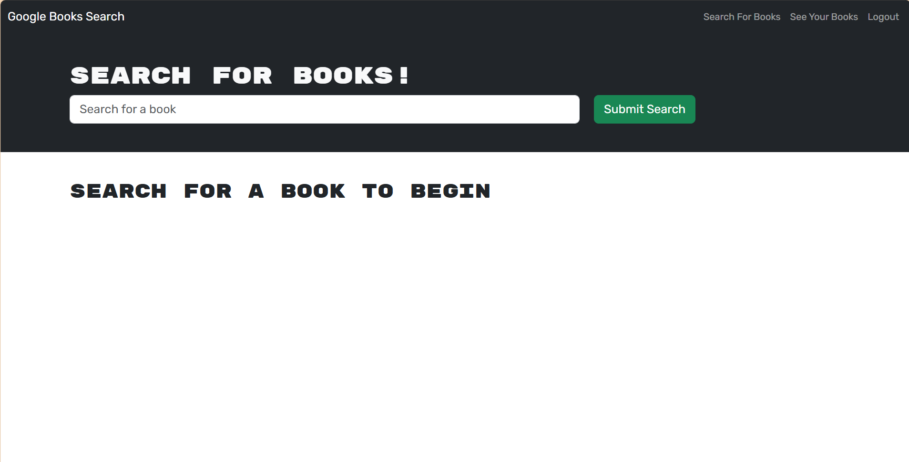
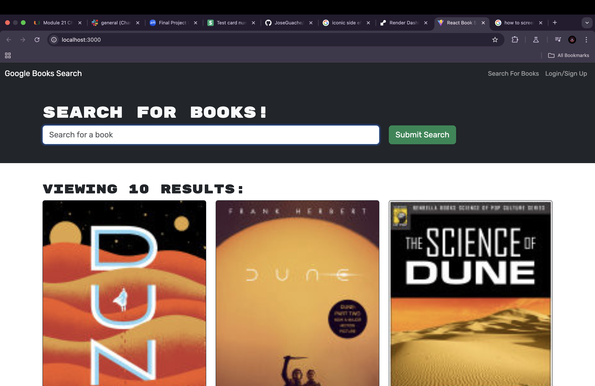

# Boook Engine

<a href= 'https://book-engine-2huz.onrender.com/'> Live Link on Render </a>

## Table of Contents

- [Installation](#installation)
- [Usage](#usage)
- [Features](#features)
- [Technologies Used](#technologies-used)
- [Testing](#testing)
- [License](#license)

## Description

This project involves refactoring a fully functioning Google Books API search engine from a RESTful API to a GraphQL API using Apollo Server. The application is built with the MERN stack, including a React front end, MongoDB database, and Node.js/Express.js server and API. It allows users to search for books via the Google Books API and save their favorite searches to the back end.

## Requirements

To successfully complete this challenge, the following tasks must be accomplished:

Apollo Server Setup: Replace the existing RESTful API with a GraphQL API using Apollo Server. Implement GraphQL queries and mutations for fetching and modifying data.

Authentication Middleware: Update the existing authentication middleware to function in the context of a GraphQL API.

Apollo Provider: Integrate an Apollo Provider to enable the front end to communicate with the Apollo Server.

Deployment: Deploy the refactored application to Render for hosting.

## Technologies Used

MongoDB: Database for storing user data and saved books.

Express.js: Server framework for handling routes and middleware.

React: Front-end library for building the user interface.

Node.js: JavaScript runtime for server-side logic.

GraphQL: Query language for the API.

Apollo Server: GraphQL server for handling queries and mutations.

Render: Deployment platform for hosting the application.

## Features

Search for books using the Google Books API.

Save book searches to a user account.

Authentication for user accounts to manage saved searches.

GraphQL API for efficient data retrieval and manipulation.

## Installation

Clone the repository:

git clone <repository-url>

Navigate to the project directory:

cd book-search-engine

Install dependencies:

npm install

Set up environment variables in a .env file (e.g., database URI, API keys).

## Usage

Start the development server:

npm start

Open your browser and navigate to http://localhost:3000 to use the application.

Deployment

The application is deployed to Render. You can access the live application here.

Contributing

Contributions are welcome! If you would like to contribute, please follow these steps:

Fork the repository.

Create a new branch for your feature or bugfix:

git checkout -b feature-name

Commit your changes:

git commit -m "Description of changes"

Push to the branch:

git push origin feature-name

Open a pull request.

## License

This project is licensed under the MIT License.

